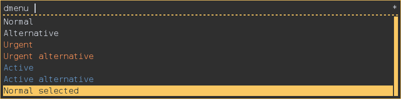
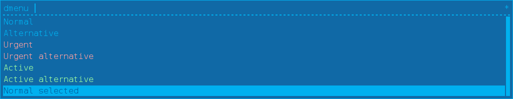

# Rofi Themes: 

# blor
## Screenshot

## XResources
```
! ------------------------------------------------------------------------------
! ROFI Color theme
! ------------------------------------------------------------------------------
! Use extended color scheme
rofi.color-enabled:                  true
! Color scheme for normal row
rofi.color-normal:                   argb:00000000,  #D8DEE9 , argb:00000000,  #FAC863 ,  #1B2B34
! Color scheme for urgent row
rofi.color-urgent:                   argb:00000000,  #F99157 , argb:00000000,  #F99157 ,  #1B2B34
! Color scheme for active row
rofi.color-active:                   argb:00000000,  #6699CC , argb:00000000,  #6699CC ,  #1B2B34
! Color scheme window
rofi.color-window:                   argb:ee222222,  #FAC863 ,  #FAC863
```
# blue
## Screenshot

## XResources
```
! ------------------------------------------------------------------------------
! ROFI Color theme
! ------------------------------------------------------------------------------
! Use extended color scheme
rofi.color-enabled:                  true
! Color scheme for normal row
rofi.color-normal:                   argb:00000000, #00b0ef, argb:00000000, #00b0ef,#0060a0
! Color scheme for urgent row
rofi.color-urgent:                   argb:00000000, #ffa0a0, argb:00000000, #ffa0a0,#0060a0
! Color scheme for active row
rofi.color-active:                   argb:00000000, #a0ffa0, argb:00000000, #a0ffa0,#0060a0
! Color scheme window
rofi.color-window:                   argb:ee0060a0, #00b0ef,#00b0ef
```
