# Rofi Themes: 
Below a list of user contributed **rofi** themes.

# Arc.theme

## Screenshot

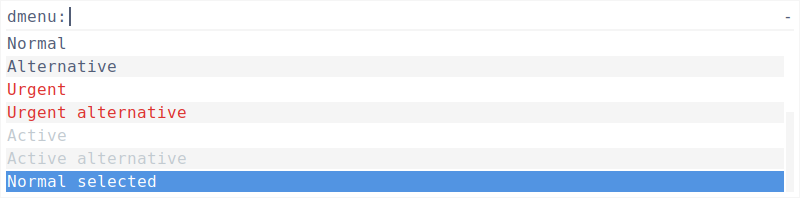

## XResources

~~~
! ------------------------------------------------------------------------------
! ROFI Color theme
! ------------------------------------------------------------------------------
! Use extended color scheme
rofi.color-enabled:                  true
! Color scheme for normal row
rofi.color-normal:                   #ffffff,#525d76,#f5f5f5,#5294e2,#ffffff
! Color scheme for urgent row
rofi.color-urgent:                   #ffffff,#dc322f,#f5f5f5,#5294e2,#dc322f
! Color scheme for active row
rofi.color-active:                   #ffffff,#c2cad0,#f5f5f5,#5294e2,#c2cad0
! Color scheme window
rofi.color-window:                   #ffffff,#f5f5f5
! Separator style (none, dash, solid)
rofi.separator-style:                solid
~~~

# DarkBlue.theme
by qball

## Screenshot

## XResources

~~~
! ------------------------------------------------------------------------------
! ROFI Color theme
! ------------------------------------------------------------------------------
! "Color scheme for normal row" Set from: File
rofi.color-normal:                   argb:0000000, #dbdfbc, argb:00000000, #dbdfbc, #02143f
! "Color scheme for urgent row" Set from: File
rofi.color-urgent:                   argb:0000000, #ff81ff, argb:00000000, #ff817f, #02143f
! "Color scheme for active row" Set from: File
rofi.color-active:                   argb:0000000, #8ac4ff, argb:00000000, #8ac4ff, #02143f
! "Color scheme window" Set from: File
rofi.color-window:                   argb:dd000021, #dbdfbc, #dbdfbc
! "Separator style (none, dash, solid)" Set from: XResources
rofi.separator-style:                solid
~~~

# Indego.theme
by qball

## Screenshot

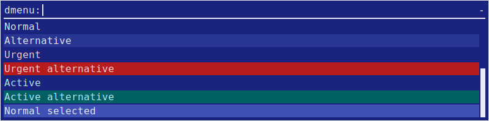

## XResources

~~~
! ------------------------------------------------------------------------------
! ROFI Color theme
! ------------------------------------------------------------------------------
! "Color scheme for normal row" Set from: File
rofi.color-normal:                   argb:07986cb, #e8eaf6, #283593, #3f51b5, #e8eaf6
! "Color scheme for urgent row" Set from: File
rofi.color-urgent:                   argb:0fdf6e3, #ffcdd2, #b71c1c, #ffcdd2, #b71c1c
! "Color scheme for active row" Set from: File
rofi.color-active:                   argb:0fdf6e3, #b2ebf2, #006064, #b2ebf2, #006064
! "Color scheme window" Set from: File
rofi.color-window:                   #1a237e, #e8eaf6, #e8eaf6
! "Separator style (none, dash, solid)" Set from: XResources
rofi.separator-style:                solid
~~~

# Paper.theme
by qball

## Screenshot

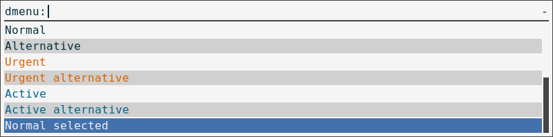

## XResources

~~~
! ------------------------------------------------------------------------------
! ROFI Color theme
! ------------------------------------------------------------------------------
! "Color scheme for normal row" Set from: File
rofi.color-normal:                   argb:0f5f5f5, #002b36, #d0d0d0, #4271ae, #f5f5f5
! "Color scheme for urgent row" Set from: File
rofi.color-urgent:                   #f5f5f5, #d75f00, #d0d0d0, #d75f00, #f5f5f5
! "Color scheme for active row" Set from: File
rofi.color-active:                   #f5f5f5, #005f87, #d0d0d0, #005f87, #f5f5f5
! "Color scheme window" Set from: File
rofi.color-window:                   #f5f5f5, #444444, #444444
! "Separator style (none, dash, solid)" Set from: File
rofi.separator-style:                solid
~~~

# android_notification.theme
by Rasi

## Screenshot

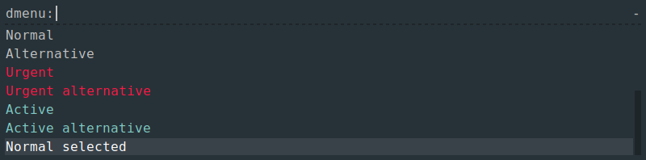

## XResources

~~~
! ------------------------------------------------------------------------------
! ROFI Color theme
! ------------------------------------------------------------------------------
rofi.color-enabled: true
rofi.color-window: #273238, #273238, #1e2529
rofi.color-normal: #273238, #c1c1c1, #273238, #394249, #ffffff
rofi.color-active: #273238, #80cbc4, #273238, #394249, #80cbc4
rofi.color-urgent: #273238, #ff1844, #273238, #394249, #ff1844
~~~

# blor.theme

## Screenshot

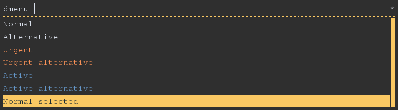

## XResources

~~~
! ------------------------------------------------------------------------------
! ROFI Color theme
! ------------------------------------------------------------------------------
! Use extended color scheme
rofi.color-enabled:                  true
! Color scheme for normal row
rofi.color-normal:                   argb:00000000,  #D8DEE9 , argb:00000000,  #FAC863 ,  #1B2B34
! Color scheme for urgent row
rofi.color-urgent:                   argb:00000000,  #F99157 , argb:00000000,  #F99157 ,  #1B2B34
! Color scheme for active row
rofi.color-active:                   argb:00000000,  #6699CC , argb:00000000,  #6699CC ,  #1B2B34
! Color scheme window
rofi.color-window:                   argb:ee222222,  #FAC863 ,  #FAC863
! Separator style (none, dash, solid)
rofi.separator-style:                solid
~~~

# blue.theme

## Screenshot

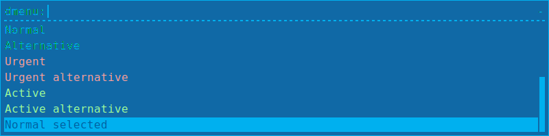

## XResources

~~~
! ------------------------------------------------------------------------------
! ROFI Color theme
! ------------------------------------------------------------------------------
! Use extended color scheme
rofi.color-enabled:                  true
! Color scheme for normal row
rofi.color-normal:                   argb:00000000, #00b0ef, argb:00000000, #00b0ef,#0060a0
! Color scheme for urgent row
rofi.color-urgent:                   argb:00000000, #ffa0a0, argb:00000000, #ffa0a0,#0060a0
! Color scheme for active row
rofi.color-active:                   argb:00000000, #a0ffa0, argb:00000000, #a0ffa0,#0060a0
! Color scheme window
rofi.color-window:                   argb:ee0060a0, #00b0ef,#00b0ef
~~~

# c64.theme
by Rasi

## Screenshot

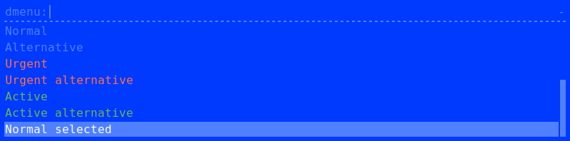

## XResources

~~~
! ------------------------------------------------------------------------------
! ROFI Color theme
! ------------------------------------------------------------------------------
rofi.color-enabled: true
rofi.color-window: #0039ff, #0039ff, #4F80FF
rofi.color-normal: #0039ff, #4f80ff, #0039ff, #4f80ff, #ffffff
rofi.color-active: #0039ff, #68ba50, #0039ff, #4f80ff, #68ba50
rofi.color-urgent: #0039ff, #ff7047, #0039ff, #4f80ff, #ff7047
~~~

# glue_pro_blue.theme
by Rasi

## Screenshot

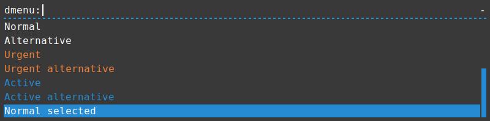

## XResources

~~~
! ------------------------------------------------------------------------------
! ROFI Color theme
! ------------------------------------------------------------------------------
rofi.color-enabled: true
rofi.color-window: #393939, #393939, #268bd2
rofi.color-normal: #393939, #ffffff, #393939, #268bd2, #ffffff
rofi.color-active: #393939, #268bd2, #393939, #268bd2, #205171
rofi.color-urgent: #393939, #f3843d, #393939, #268bd2, #ffc39c
~~~

# lb.theme

## Screenshot

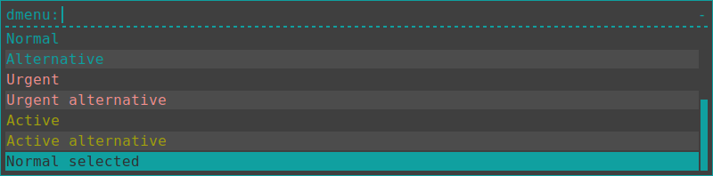

## XResources

~~~
! ------------------------------------------------------------------------------
! ROFI Color theme
! ------------------------------------------------------------------------------

! Use extended color scheme
rofi.color-enabled:                  true
! Color scheme for normal row
rofi.color-normal:                   argb:00000000, #1aa, argb:11FFFFFF, #1aa,#333
! Color scheme for urgent row
rofi.color-urgent:                   argb:00000000, #f99, argb:11FFFFFF, #f99,#333
! Color scheme for active row
rofi.color-active:                   argb:00000000, #aa1, argb:11FFFFFF, #aa1,#333
! Color scheme window
rofi.color-window:                   argb:ee333333, #1aa,#1aa
! Separator style (none, dash, solid)
rofi.separator-style:                dash
~~~

# purple.theme
by Rasi

## Screenshot

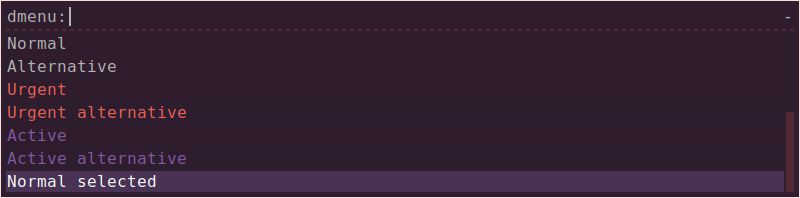

## XResources

~~~
! ------------------------------------------------------------------------------
! ROFI Color theme
! ------------------------------------------------------------------------------
! Use extended color scheme
rofi.color-enabled:                  true
! Color scheme for normal row
rofi.color-normal:                   argb:a02f1e2e, #b4b4b4, argb:a02f1e2e, argb:54815ba4, #ffffff
! Color scheme for urgent row
rofi.color-urgent:                   argb:272f1e2e, #ef6155, argb:2f2f1e2e, argb:54815ba4, #ef6155
! Color scheme for active row
rofi.color-active:                   argb:272f1e2e, #815ba4, argb:2f2f1e2e, argb:54815ba4, #815ba4
! Color scheme window
rofi.color-window:                   #2f1e2e, argb:36ef6155, argb:2fef6155
! Separator style (none, dash, solid)
rofi.separator-style:                dash
~~~

# solarized.theme
by Rasi

## Screenshot

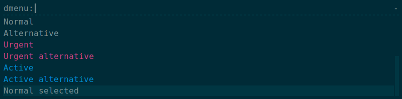

## XResources

~~~
! ------------------------------------------------------------------------------
! ROFI Color theme
! ------------------------------------------------------------------------------
rofi.color-enabled: true
rofi.color-window: #002b37, #002b37, #003642
rofi.color-normal: #002b37, #819396, #002b37, #003642, #819396
rofi.color-active: #002b37, #008ed4, #002b37, #003642, #008ed4
rofi.color-urgent: #002b37, #da4281, #002b37, #003642, #da4281
~~~

# solarized_alternate.theme
by Rasi

## Screenshot

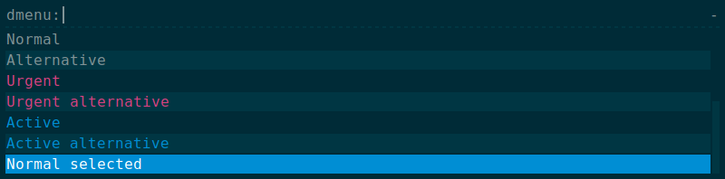

## XResources

~~~
! ------------------------------------------------------------------------------
! ROFI Color theme
! ------------------------------------------------------------------------------
rofi.color-enabled: true
rofi.color-window: #002b37, #002b37, #003642
rofi.color-normal: #002b37, #819396, #003643, #008ed4, #ffffff
rofi.color-active: #002b37, #008ed4, #003643, #008ed4, #66c6ff
rofi.color-urgent: #002b37, #da4281, #003643, #008ed4, #890661
~~~

# gruvbox-dark-hard.theme

## Screenshot

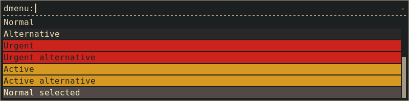

## XResources

~~~
!-------------------------------------------------------------------------------
! Rofi color theme
!
! Based on the Gruvbox color scheme for Vim by morhetz
! https://github.com/morhetz/gruvbox
!
! File: gruvbox-dark-hard.theme
! Desc: Gruvbox dark (hard contrast) color theme for Rofi
! Author: bardisty <b@bah.im>
! Source: https://github.com/bardisty/gruvbox-rofi
! Modified: Sat Oct 22 2016 03:12:10 PDT -0700
!-------------------------------------------------------------------------------

! Enable the extended coloring options
rofi.color-enabled: true

!                  bg       border   separator
rofi.color-window: #1d2021, #a89984, #a89984

!                  bg       fg       bg-alt   hl-bg    hl-fg
rofi.color-normal: #1d2021, #ebdbb2, #282828, #504945, #fbf1c7
rofi.color-active: #d79921, #1d2021, #d79921, #fabd2f, #1d2021
rofi.color-urgent: #cc241d, #1d2021, #cc241d, #fb4934, #1d2021
~~~

# gruvbox-dark-soft.theme

## Screenshot

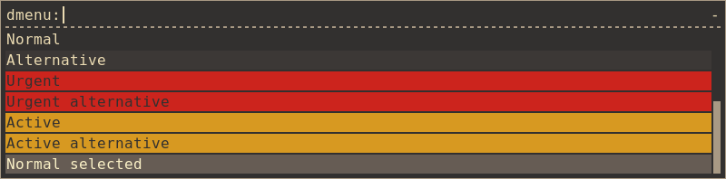

## XResources

~~~
!-------------------------------------------------------------------------------
! Rofi color theme
!
! Based on the Gruvbox color scheme for Vim by morhetz
! https://github.com/morhetz/gruvbox
!
! File: gruvbox-dark-soft.theme
! Desc: Gruvbox dark (soft contrast) color theme for Rofi
! Author: bardisty <b@bah.im>
! Source: https://github.com/bardisty/gruvbox-rofi
! Modified: Sat Oct 22 2016 03:11:49 PDT -0700
!-------------------------------------------------------------------------------

! Enable the extended coloring options
rofi.color-enabled: true

!                  bg       border   separator
rofi.color-window: #32302f, #a89984, #a89984

!                  bg       fg       bg-alt   hl-bg    hl-fg
rofi.color-normal: #32302f, #ebdbb2, #3c3836, #665c54, #fbf1c7
rofi.color-active: #d79921, #32302f, #d79921, #fabd2f, #32302f
rofi.color-urgent: #cc241d, #32302f, #cc241d, #fb4934, #32302f
~~~

# gruvbox-dark.theme

## Screenshot

## XResources

~~~
!-------------------------------------------------------------------------------
! Rofi color theme
!
! Based on the Gruvbox color scheme for Vim by morhetz
! https://github.com/morhetz/gruvbox
!
! File: gruvbox-dark.theme
! Desc: Gruvbox dark color theme for Rofi
! Author: bardisty <b@bah.im>
! Source: https://github.com/bardisty/gruvbox-rofi
! Modified: Sat Oct 22 2016 03:11:40 PDT -0700
!-------------------------------------------------------------------------------

! Enable the extended coloring options
rofi.color-enabled: true

!                  bg       border   separator
rofi.color-window: #282828, #a89984, #a89984

!                  bg       fg       bg-alt   hl-bg    hl-fg
rofi.color-normal: #282828, #ebdbb2, #32302f, #665c54, #fbf1c7
rofi.color-active: #d79921, #282828, #d79921, #fabd2f, #282828
rofi.color-urgent: #cc241d, #282828, #cc241d, #fb4934, #282828
~~~

# gruvbox-light-hard.theme

## Screenshot

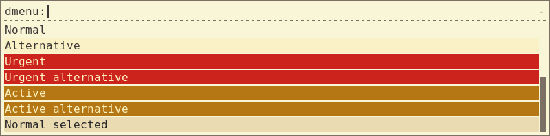

## XResources

~~~
!-------------------------------------------------------------------------------
! Rofi color theme
!
! Based on the Gruvbox color scheme for Vim by morhetz
! https://github.com/morhetz/gruvbox
!
! File: gruvbox-light-hard.theme
! Desc: Gruvbox light (hard contrast) color theme for Rofi
! Author: bardisty <b@bah.im>
! Source: https://github.com/bardisty/gruvbox-rofi
! Modified: Sat Oct 22 2016 03:11:32 PDT -0700
!-------------------------------------------------------------------------------

! Enable the extended coloring options
rofi.color-enabled: true

!                  bg       border   separator
rofi.color-window: #f9f5d7, #7c6f64, #7c6f64

!                  bg       fg       bg-alt   hl-bg    hl-fg
rofi.color-normal: #f9f5d7, #3c3836, #fbf1c7, #ebdbb2, #282828
rofi.color-active: #b57614, #fdf4c1, #b57614, #d79921, #fdf4c1
rofi.color-urgent: #cc241d, #fdf4c1, #cc241d, #fb4934, #fdf4c1
~~~

# gruvbox-light-soft.theme

## Screenshot

## XResources

~~~
!-------------------------------------------------------------------------------
! Rofi color theme
!
! Based on the Gruvbox color scheme for Vim by morhetz
! https://github.com/morhetz/gruvbox
!
! File: gruvbox-light-soft.theme
! Desc: Gruvbox light (soft contrast) color theme for Rofi
! Author: bardisty <b@bah.im>
! Source: https://github.com/bardisty/gruvbox-rofi
! Modified: Sat Oct 22 2016 03:11:25 PDT -0700
!-------------------------------------------------------------------------------

! Enable the extended coloring options
rofi.color-enabled: true

!                  bg       border   separator
rofi.color-window: #f2e5bc, #7c6f64, #7c6f64

!                  bg       fg       bg-alt   hl-bg    hl-fg
rofi.color-normal: #f2e5bc, #3c3836, #ebdbb2, #d5c4a1, #282828
rofi.color-active: #b57614, #f2e5bc, #b57614, #d79921, #f2e5bc
rofi.color-urgent: #cc241d, #f2e5bc, #cc241d, #fb4934, #f2e5bc
~~~

# gruvbox-light.theme

## Screenshot

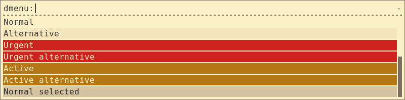

## XResources

~~~
!-------------------------------------------------------------------------------
! Rofi color theme
!
! Based on the Gruvbox color scheme for Vim by morhetz
! https://github.com/morhetz/gruvbox
!
! File: gruvbox-light.theme
! Desc: Gruvbox light color theme for rofi
! Author: bardisty <b@bah.im>
! Source: https://github.com/bardisty/gruvbox-rofi
! Modified: Sat Oct 22 2016 03:11:11 PDT -0700
!-------------------------------------------------------------------------------

! Enable the extended coloring options
rofi.color-enabled: true

!                  bg       border   separator
rofi.color-window: #fbf1c7, #7c6f64, #7c6f64

!                  bg       fg       bg-alt   hl-bg    hl-fg
rofi.color-normal: #fbf1c7, #3c3836, #f2e5bc, #d5c4a1, #282828
rofi.color-active: #b57614, #fbf1c7, #b57614, #d79921, #fbf1c7
rofi.color-urgent: #cc241d, #fbf1c7, #cc241d, #fb4934, #fbf1c7
~~~

